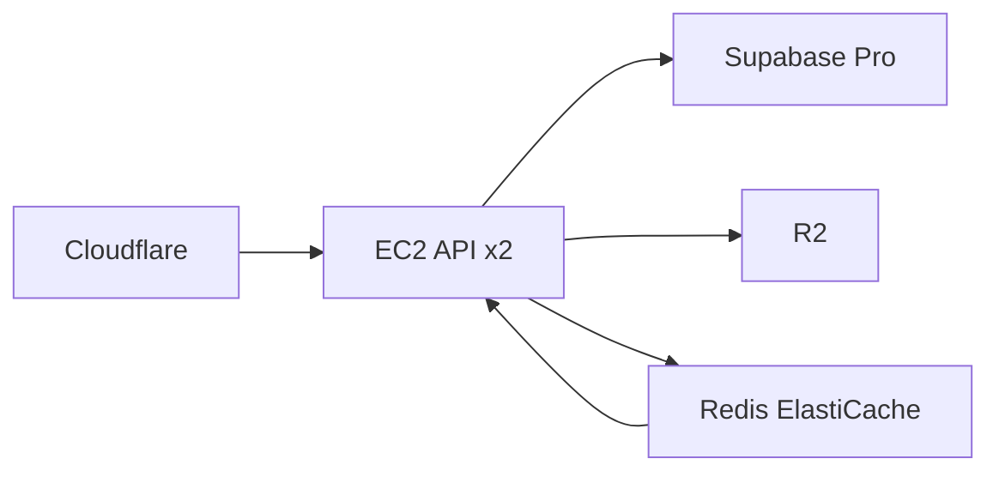
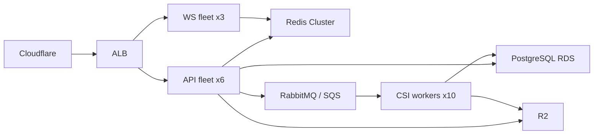

# Scaling & Migration Plan

## Current Architecture (Phase 0)
```
Cloudflare (CDN + WAF)
  └── EC2 t2.medium (single instance)
       ├── FastAPI (4 uvicorn workers)
       ├── WebSocket (in-process)
       └── CSI processing (in-process)
            ├── Cloudflare R2 (object storage)
            └── Supabase PostgreSQL (shared instance)
```

## Bottlenecks at Each Scale

### Tier 1: 1–100 homes (R30–R3k MRR)
**Current architecture holds fine.**

| Resource | Limit | At 100 homes |
|----------|-------|-------------|
| PostgreSQL connections | 15 (Supabase Free) | ~2-3 concurrent |
| CSI storage (R2) | Infinite | ~12.6 GB / 90 days |
| API throughput | 4 workers × ~100 req/s | ~2 req/s peak |
| WebSocket connections | ~1,000 per Python process | ~100 concurrent |

**Changes needed: None**

---

### Tier 2: 100–1,000 homes (R3k–R30k MRR)

| Resource | Limit | At 1,000 homes |
|----------|-------|---------------|
| PostgreSQL connections | 60 (Supabase Pro $25/mo) | ~15-20 concurrent |
| CSI storage (R2) | Infinite | ~126 GB / 90 days |
| API throughput | 4 workers × ~100 req/s | ~20 req/s peak |
| WebSocket connections | ~1,000 per Python process | ~1,000 concurrent |

**Migration at this tier:**



| Action | Why | Cost |
|--------|-----|------|
| Up Supabase to Pro ($25/mo) | More connections, read replicas | +$25/mo |
| Add Redis ElastiCache (t4g.small) | Session store, rate limiter, WS presence | ~$15/mo |
| Add 2nd EC2 behind ALB | Horizontal API scaling | ~$30/mo |
| Offload WebSocket to dedicated process | Isolate connection churn from API | Free (code change) |

**Code changes needed:**
- Move rate limiter from in-process dict to Redis
- Move WebSocket manager to Redis pub/sub or standalone WS server
- Add async task queue (Celery + Redis) for CSI reprocessing
- ELB health check + target group config

---

### Tier 3: 1,000–10,000 homes (R30k–R300k MRR)

| Resource | Limit | At 10,000 homes |
|----------|-------|-----------------|
| PostgreSQL | Supabase Team ($599/mo) or RDS dedicated | ~150-200 concurrent |
| CSI storage (R2) | Infinite | ~1.26 TB / 90 days |
| CSI ingest rate | ~200 CSI pushes/sec | ~2,000 req/s peak |
| WebSocket connections | ~10,000 per WS server | ~10,000 concurrent |

**Architecture:**



| Action | Why | Cost |
|--------|-----|------|
| Dedicated RDS PostgreSQL (db.r6g.large) | Supabase ceiling hit, need own instance | ~$300/mo |
| PgBouncer connection pool | Handle 10k+ connections | Free |
| API fleet (6× t3.medium) | Horizontal scale behind ALB | ~$200/mo |
| WS fleet (3× t3.small) | Dedicated WebSocket servers | ~$75/mo |
| Redis Cluster (3× t4g.small) | Pub/sub across WS fleet | ~$45/mo |
| RabbitMQ or SQS | Async CSI processing queue | ~$50/mo |
| CSI worker pool (10× spot) | Heavy CSI reprocessing off API path | ~$50/mo |
| Read replicas (2×) | Dashboard queries hit replica, not master | ~$100/mo |

**Code changes needed:**
- Extract CSI processing from API process into background workers
- Replace in-process Wellness detectors + Premium detectors with DB-backed state
- Add PostgreSQL LISTEN/NOTIFY or Redis pub/sub for cross-process WS broadcast
- Add connection pooling (asyncpg + PgBouncer)
- Add auto-scaling group for API + WS fleets

---

### Tier 4: 10,000–100,000 homes (R300k–R3M MRR)

| Action | Why | Cost |
|--------|-----|------|
| RDS Multi-AZ with read replicas | HA + read scaling | ~$2,000/mo |
| TimescaleDB or Citus | Time-series sharding | ~$500/mo |
| Kafka / Redpanda | Event streaming for CSI | ~$300/mo |
| CSI workers on spot (50+) | Parallel CSI processing | ~$250/mo |
| Kubernetes (EKS) | Container orchestration | ~$200/mo |
| Multi-region R2 | Regional data locality | ~$100/mo |
| Dedicated analytics DB (ClickHouse) | Dashboard + reporting queries | ~$500/mo |

**Key architectural changes:**
- Move from PostgreSQL to **TimescaleDB** for time-series event data (hypertables auto-shard by home_id + timestamp)
- Move CSI events from DB to **Kafka** stream — DB stores only final alerts
- Replace Celery with **Kafka Streams** for real-time CSI processing
- All wellness/premium detectors become Kafka consumers
- Dashboard reads from **ClickHouse** materialized views (pre-aggregated)
- WebSocket fleet uses **Redis Cluster** pub/sub for cross-region broadcast

---

## Tier 5: 100,000–1,000,000 homes (R3M–R30M MRR)

At this tier, PostgreSQL is **no longer the event database**. The write volume (1M events/sec) exceeds what any single-node PostgreSQL can handle. The architecture fundamentally changes at 100k homes.

### Data Volumes at 1M Homes

| Metric | Value |
|--------|:-----:|
| Events/sec average | 1,000,000 |
| Events/sec peak | 10,000,000 |
| Daily metadata | 17 TB (can't do this in PG) |
| Daily CSI (R2) | 8.8 TB (R2 handles this fine) |
| 90-day metadata | 1.5 PB |
| 90-day CSI (R2) | 800 TB |

### Architecture

```
                     ┌─────────────────────────────┐
                     │   Cloudflare (CDN + WAF)     │
                     └──────────┬──────────────────┘
                                │
                     ┌──────────▼──────────────────┐
                     │     Global Load Balancer     │
                     │  (multi-region: ZA, EU, US)  │
                     └──────────┬──────────────────┘
                                │
              ┌─────────────────┼────────────────────┐
              │                 │                     │
    ┌─────────▼────────┐ ┌─────▼──────┐   ┌─────────▼──────────┐
    │  Ingress Fleet   │ │  WS Fleet  │   │  API Fleet         │
    │  50× c6g.large   │ │  20×       │   │  30× c6g.large     │
    │  (K8s + HPA)     │ │  t3.small  │   │  (stateless)       │
    └─────────┬────────┘ └─────┬──────┘   └─────────┬──────────┘
              │                │                     │
              │         ┌──────▼──────┐              │
              │         │  Redis      │              │
              │         │  Cluster    │              │
              │         │  (pub/sub)  │              │
              │         └─────────────┘              │
              │                                      │
    ┌─────────▼──────────────────────────────────┐   │
    │              Kafka / Redpanda               │   │
    │  (500 partitions, 15× m6i.large brokers)   │   │
    │  Retention: 7 days                          │   │
    └─────────┬──────────────────────────────────┘   │
              │                                      │
    ┌─────────▼──────────────────────────────────┐   │
    │         Kafka Streams Pipeline              │   │
    │  ┌──────────┐ ┌──────────┐ ┌────────────┐  │   │
    │  │ CSI      │ │ Wellness │ │ Premium    │  │   │
    │  │ Router   │ │ Pipeline │ │ Pipeline   │  │   │
    │  │ → R2     │ │          │ │            │  │   │
    │  └──────────┘ └──────────┘ └────────────┘  │   │
    └──────────────────────┬──────────────────────┘   │
                           │                          │
              ┌────────────▼──────────────────────┐   │
              │        ClickHouse (16 nodes)       │◄──┘
              │  Event metadata + aggregated views  │
              │  ~5:1 compression = 300 TB raw     │
              │  → 60 TB stored                    │
              └────────────┬──────────────────────┘
                           │
              ┌────────────▼──────────────────────┐
              │     PostgreSQL RDS (Multi-AZ)      │
              │  Final alerts only (not raw events)│
              │  ~1,000 alerts/day × 200 bytes ×   │
              │  1M homes = ~200 MB/day            │
              └────────────────────────────────────┘
```

### Infrastructure Costs at 1M Homes

| Component | Spec | Monthly (USD) |
|-----------|------|:-------------:|
| **Kubernetes (EKS)** | Control plane + 100 nodes | ~$5,000 |
| **Ingress Fleet** | 50× c6g.large (spot) | ~$3,000 |
| **API Fleet** | 30× c6g.large (spot) | ~$1,800 |
| **WS Fleet** | 20× t3.small (spot) | ~$400 |
| **Kafka / Redpanda** | 15× m6i.large (EBS gp3) | ~$6,000 |
| **ClickHouse** | 16× i4i.xlarge (NVMe local) | ~$12,000 |
| **PostgreSQL RDS** | 2× db.r6g.xlarge Multi-AZ | ~$2,000 |
| **Redis Cluster** | 5× r6g.large | ~$1,500 |
| **R2 Object Storage** | 800 TB CSI @ $0.015/GB | ~$12,000 |
| **Cloudflare Enterprise** | Enterprise plan | ~$3,000 |
| **Data Transfer (Cloudflare)** | ~1 PB/mo egress | ~$0 (bundled) |
| **SRE Team** | 5–8 engineers | ~$80,000 |
| **Backend Engineers** | 3–5 engineers | ~$50,000 |
| **Data Engineers** | 2–3 engineers | ~$30,000 |
| **Total Infra** | | **~$47,000** |
| **Total Team** | | **~$160,000** |
| **Gross Infra + Team** | | **~$207,000/mo** |
| **Revenue** | R30M/mo = $1.5M | **$1,500,000/mo** |
| **Net margin** | | **~86%** |

### What Changes (from Tier 4)

| Component | Tier 4 (100k) | Tier 5 (1M) |
|-----------|---------------|-------------|
| **Event DB** | TimescaleDB (writes directly) | Kafka → ClickHouse (no direct writes) |
| **CSI processing** | Celery workers | Kafka Streams (stateful, exactly-once) |
| **API** | Autoscaling group | K8s with HPA per endpoint |
| **WebSocket** | Redis pub/sub | Redis Cluster + WS per region |
| **Deployment** | Manual EC2 + Docker | K8s Helm charts, GitOps (ArgoCD) |
| **Alert DB** | Same as events DB | Separate PostgreSQL for final alerts only |
| **Team** | 2-3 people | 15-20 people |

### Key Architectural Decisions

1. **Kafka events, no DB writes in the hot path**
   - Devices push to ingress → Kafka partition by home_id
   - Kafka Streams processes CSI → stores raw to R2
   - Kafka Streams runs wellness/premium detectors
   - Streams writes to ClickHouse in micro-batches
   - API queries ClickHouse for events, RDS for alerts/subscriptions

2. **ClickHouse replaces PostgreSQL for events**
   - Materialized views pre-aggregate per home per hour
   - Dashboard queries hit pre-aggregates, not raw events
   - Compression ratio ~5:1 for the metadata schema
   - 1.5 PB raw → ~300 TB stored → ~12 TB/month new data

3. **RDS PostgreSQL handles only final state**
   - Alerts (not raw events)
   - User accounts, subscriptions, API keys
   - Home config, zone config, arming schedules
   - Total write volume: ~200 MB/day

4. **Multi-region**
   - Primary: AWS af-south-1 (Cape Town) — SA user traffic
   - Secondary: eu-west-1 (Ireland) — EU CDN origin + DR
   - CSI data stays in home region for POPIA compliance
   - ClickHouse uses distributed tables across regions

### Timeline to Reach 1M Architecture

| From | To | Effort | Cost |
|------|----|:------:|:----:|
| Today's code | Tier 4 (100k) architecture | ~4 weeks of migration work | ~$1,500 |
| Tier 4 | Kafka ingress (no DB writes in hot path) | ~6 weeks | ~$5,000 |
| Kafka | ClickHouse event store | ~4 weeks | ~$3,000 |
| ClickHouse | K8s deployment | ~4 weeks | ~$2,000 |
| K8s | Multi-region | ~6 weeks | ~$5,000 |
| Multi-region | 1M scale | Ongoing team ramp | Hiring |

### Bottleneck Analysis

| What hits first | At | Mitigation |
|-----------------|:--:|------------|
| PostgreSQL writes | ~50k homes | Kafka → ClickHouse before this (migrate at 10k) |
| Kafka partition throughput | ~200k homes | Increase partitions, add brokers |
| ClickHouse query concurrency | ~500k homes | Add read replicas, more pre-aggregation |
| WebSocket connections | ~500k homes (in ZA region) | Multi-region WS fleet |
| SRE team bandwidth | ~100k homes | Add engineers, automate everything |
